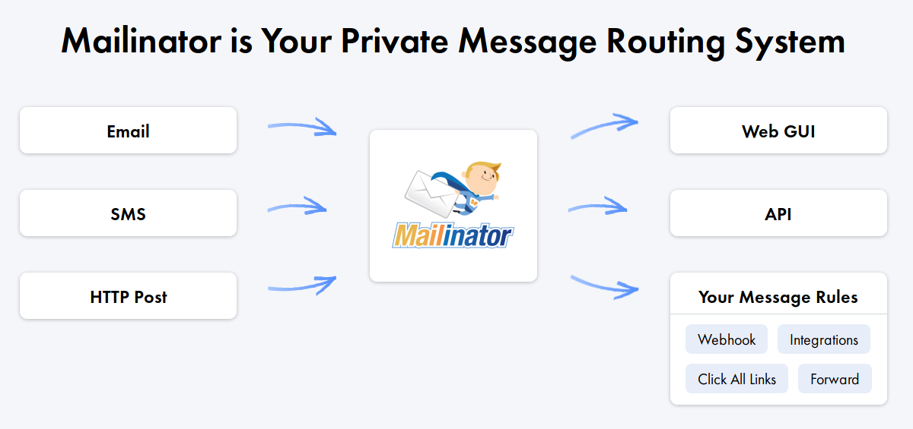
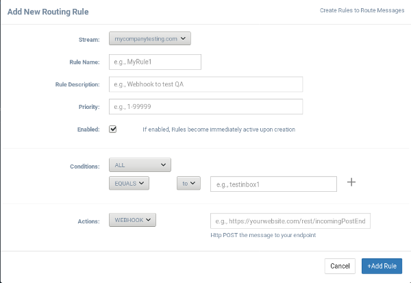

# Mailinator

Whereas most email systems are bulit around the concept of "account/inbox ownership", Mailinator is an email system built around "entire domain inbox ownership". This allows companies to have instant access to millions of email addresses for system and automation testing of their software.

Mailinator also provides a "public" domain for personal use where all email addresses (@mailinator.com) are completely public and usable by anyone.

## Public Mailinator (all email @mailinator.com)

The public Mailinator system (i.e. every possible email address @mailinator.com) creates inboxes when email arrives for them. All inboxes (and emails) are in the public domain. They are readable and deleteable by anyone. By design, there is NO privacy in the public Mailinator system and is intended for occasional, personal use.

In addition, all emails in the public Mailinator system auto-delete after a few hours. They are un-retrievable after this happens. Public Mailinator emails also may not contain attachments (if they do, they will either not be delivered, or have their attachments stripped before delivery).

Finally, it's important to note that the Mailinator system is RECEIVE-ONLY. <b>No one can send an email from Mailinator.</b> (Any email appearing to have arrived from an @mailinator address has had it's "From" field forged to appear as such).

There is no need to sign-up to use the public Mailinator system. Simply go to the home page and enter an inbox name (i.e. anything you wish up to 50 characters) to check a particular inbox.

Again, the public Mailinator is intended for personal and occasional use hence usage limits apply. Please see our Upgrade plans for corporate users.

## Private Mailinator

Mailinator offers upgraded subscriptions for corporate users wishing to use the Mailinator system. This offers many benefits.

Subscribers receive one or more "Private Domains" which provide a private version of Mailinator. That is, you control all inboxes for a given domain (i.e. either one your provide or the system will provide one for you). You may view all such inboxes in one "super inbox" which lists every email coming into the domain in realtime. Emails in Private domains are not automatically deleted until your team's storage is exhausted. At this time, new emails push out old emails. Otherwise, emails in private domains are persistent as long as the account is active.

In addition, Private users gain API access to messages within the Mailinator system. Subscribers may use the API to access all email in their Private Domain(s) in addition to the Public Mailinator system.

## Message Delivery



Messages arrive in the Mailinator system several ways.

+ Email
+ SMS
+ HTTP Post

The classic way is they arrive as email. However, messages may also enter the system via SMS (i.e. text message), or HTTP Post. Regardless of how a message arrives, it lands in a designated inbox and is then available for retrieval or manipulation/re-delivery via the rule systesm.

## Message Access

### Web

The web interface is available for all Public and Private email in the Mailinator system. Subscribers must login first in order to see their Private Team Inbox containing mail sent to their Private Domain(s). The Web interface will first attempt to show a message as an email. However, if the formatting of the message does not follow email conventions (i.e. maybe it arrived as an HTTP Post with a custom format), the message will be displayed in raw JSON.

### API

Subscribers may use programmatic access to poll inboxes and retrieve emails in JSON format. Documentation for the API can be found below.

### Rules

Instead of pulling emails via the API, Subscribers may set rules for Mailinator to "push" messages to them as they arrive. The rule system may be configured via the Web interface (i.e. Mailinator Routing Rules) or programmatically via the API (see API documentation below).

The Rule system allows subscribers to match on inbox and act upon every email that matches the conditional criteria.



For example, a rule might be:

IF <b>TO = mytestinbox</b> THEN <b>POST Webhook To https://mywebsite.com/endpoint</b>

For a given Private domain, all emails that arrive to the "mytestinbox" address will be converted to JSON, and HTTP Posted to the designated endpoint.

For more information on configuring Rules, see the Rules API documentation below.

# Setting up your Mailinator Subscription

Thanks for being a Mailinator subscriber! This section will show you some immediate ways to get the most out of your Mailinator subscritpion.

You now (yes, already) have a Private domain. Every conceivable inbox at that domain is waiting for you to send email to it. Unlike the public Mailinator system however, you won't run into rate-limits or filters. The email at that domain is private to you.

When your subscription became active, a subdomain of Mailinator was created and assigned to your account as your private domain. For example, your initial private domain would be something like @you-yourcompany.m8r.co. So any email to anything@you-yourcompany.m8r.co will arrive in your private domain. On the left of the Web User Interface you'll see "Private Team Inbox". If you click that you'll be taken to the web interface for your private domain. Unlike Public Mailinator inboxes, you can see ALL incoming email to all inboxes at once! The inbox field in the upper right allows you to filter that incoming domain.

To see what your current Private Domain is, go the Team Settings section of the Web interface and you'll see it listed. You can leave it as is, change it to another subdomain, or even put in a domain you already own (you must change the DNS record MX to point to our servers for this to work).

On the Team Settings page, you'll also notice your API token. This token allows you to access all email in Mailinator (public and private) via API instead of the Web. See our API documentation below.

The Team Management screen allows you to add co-workers to your account so they too can access your private domain emails. Also, checkout the Message Routing Rules system. While it's great to read emails via the web or API, Mailinator will push emails to you via webhooks. You can set this up in the Rules System.

# The Mailinator API

The Mailinator API provides programmatic access to the Mailinator system. This includes fetching and injecting messages into the Mailinator system and creating routing rules for specific message domains within the system. Messages are typically (and historically) email messages. Hence the format of messages tend to look like emails but in reality any message can be fed, routed, and read or delivered through the system. In a broader scope messages generally arrive via email, SMS, or direct HTTP Post.

Subscribers can read messages in both the Public and their own Private Mailinator email systems with the API. They may also route/inject messages but only to their Private Mailinator domains.

Access to the API (and messages in general) are subject to your subscription plan's rate limits.

[Note: The V1 API will remain active. See the old documentation here: <a href='https://manybrain.github.io/m8rdocs/indexold.html'>HERE</a>]

## Definitions

- <b>Messages</b>

Messages within Mailinator are typically thought of as emails - however, messages can enter the system in a variety of ways including email, SMS, or HTTP Post. In general, the schema of messages contains a TO, FROM, SUBJECT, and message body. Message bodies can be simple string of text or as is allowed by email standards, a complicated multi-part, multi-encoded schema.

- **Domains / domains**

Domains (aka domains) identify a specific source for messages. Emails automatically are assigned to the domain of their "to" address. Expectedly, each of your Private Domains represent a specific source for messages. Each Domain may have it's own set of rules.

<!--
- <b>Destinations</b>

Mailinator routing rules allow immediate routing actions to take place on incoming messages. For example, you may wish to designate all incoming email messages to "Joe@YourPrivateDomain.com" should be forwarded to your work email. You could also designate that all incoming messages to "Bob@YourPrivateDomain.com" should be Posted via WebHook to an endpoint on your testing server.

You may define a set of Destinations to be reused by your rules.
-->

## SDK
Mailinator provides several official SDKs. Please select your language in the upper right to see examples in your preferred language.

Java:
  <a href='https://github.com/manybrain/mailinator-java-client' rel=nofollow>https://github.com/manybrain/mailinator-java-client</a>

``` java
Maven:
  <dependencies>
    <dependency>
      <groupId>com.manybrain</groupId>
      <artifactId>mailinator-client</artifactId>
      <version>1.0</version>
    </dependency>
  </dependencies>

Gradle:
  compile 'com.manybrain:mailinator-client:1.0'
```

## API Authentication

> To authorize, use this code:

```shell
# REST calls require your team's API token in every call
curl "https://api.mailinator.com/api_endpoint_here?token=YourTeamAPIToken"

or

curl --header "Authorization: YourTeamAPIToken"
     "https://api.mailinator.com/api_endpoint_here"
```

```java
MailinatorClient mailinatorClient = new MailinatorClient("YourTeamAPIToken");
```

> Replace YourTeamAPIToken with the API Token found on your Team's settings page

Mailinator uses API tokens for authentication. All calls to the API must include the token query parameter OR included as an HTTP Authorization header.

<aside class="notice">
You must replace <b>YourTeamAPIToken</b> with the API token found on your Team Settings page
</aside>


# Message API

## Fetch Inbox <span style='font-size:.8em'>(aka Fetch Message Summaries)
This endpoint retrieves a list of messages summaries. You can retreive a list by inbox, inboxes, or entire domain.

```shell
curl "https://api.mailinator.com/v2/domains/private/inboxes/testinbox?limit=2&sort=descending"

Response:
{
    "domain": "yourprivatedomain.com",
    "to": "testinbox"
    "msgs": [
        {
            "subject": "this is a test email 1",
            "domain": "yourprivatedomain.com",
            "from": "Our Qa Tester <qatester@company.com>"
            "id": "testinbox-1571155952-33840774",
            "to": "testinbox",
            "time": 1571155952000,
            "seconds_ago": 258277
        },
        {
            "subject": "This is my test email [with attachment]",
            "domain": "yourprivatedomain.com",
            "from": "Our Qa Tester <qatester@company.com>"
            "id": "testinbox-1570635306-12914603",
            "to": "testinbox",
            "time": 1570635306000,
            "seconds_ago": 778923
        }
    ],
   }
}

```

``` java
   Inbox inbox = mailinatorClient.request(new GetInboxRequest("private"));
   List<Message> messages = inbox.getMsgs();
   for (Message m : messages) {
     String subject = m.getSubject();
     List<Part> parts = m.getParts();
     // process message
   }

```

### HTTP Request
<b>GET</b> https://api.mailinator.com/v2/domains/<b>:domain</b>/inboxes/<b>:inbox</b>


Path Element |  Value | Description
--------- | ------- | -------- | -----------
:domain   | public  | Fetch Message Summaries from the Public Mailinator System
          | private | Fetch Message Summaries from all Your Private Domains
          | [your_private_domain.com] |  Fetch Message Summaries from a specific Private Domain
:inbox    | null    | Fetch All Messages summaries for an entire domain
          | *       | Fetch All Messages summaries for an entire domain
          | [inbox_name]   | Fetch All Messages summaries for a given Inbox
          | [inbox_name*]  | Fetch All Messages summaries for a given Inbox Prefix

### Query Parameters

Parameter | Default | Required | Description
--------- | ------- | -------- | -----------
skip | 0 | no | skip this many emails in your Private Domain
limit | 50 | no | number of emails to fetch from your Private Domain
sort | descending | no | Sort results by ascending or descending
decode_subject | false | no | true: decode encoded subjects


## Fetch Message
This endpoint retrieves a specific message by id.

```shell
curl "https://api.mailinator.com/v2/domain/private/inboxes/testinbox/messages/testinbox-1570635306-12914603"

Response:
{
    "fromfull": "Our Qa Tester <qatester.company.com>",
    "headers": {
        "mime-version": "1.0",
        "date": "Tue, 15 Oct 2019 12:12:20 -0400",
        "subject": "this is a test email 1",
        "content-type": "multipart/mixed",
    },
    "subject": "this is a test email 1",
    "parts": [
        {
            "headers": {
                "content-type": "text/plain; charset=\"UTF-8\""
            },
            "body": "here is our test email\r\n"
        },
        {
            "headers": {
                "content-type": "text/html; charset=\"UTF-8\""
            },
            "body": "<div dir=\"ltr\"><div class=\"gmail_default\"
                     style=\"font-family:tahoma,sans-serif;font-size:large\">
                     here&#39;s the test email</div></div>\r\n"
        },
        {
            "headers": {
                "content-disposition": "attachment; filename=\"notes.pdf\"",
                "content-transfer-encoding": "base64",
                "content-type": "application/pdf; name=\"notes.pdf\"",
            },
        "body": "iVBO4JYRUE2VGk85o6MBpC9E1frV8djCh24TVzy6CdiTEFkJoFGwRxy0jeivb3t8f6+e+uo4P==="
        }
    ],
    "from": "Our Qa Tester",
    "to": "testinbox",
    "id": "testinbox-1570635306-12914603",
    "time": 1571155952000,
    "seconds_ago": 260276
}

```

``` java
  // Message m = mailinatorClient.request(
  // new GetMessageRequest("<domain>", "<inbox-name>", "<msg-id>"));
    Message m = mailinatorClient.request(
      new GetMessageRequest("private", "testinbox", "testinbox-1570635306-12914603"));

   List<Parts> parts = m.getParts();
   String subject = m.getSubject();
   Map<String, Object> headers = m.getHeaders();
```

### HTTP Request
<b>GET</b> https://api.mailinator.com/v2/domains/<b>:domain</b>/inboxes/<b>:inbox</b>/messages/<b>:message_id</b>

Path Element |  Value | Description
--------- | ------- | -------- | -----------
:domain   | public  | Fetch Message Summaries from the Public Mailinator System
          | private | Fetch Message Summaries from any Private Domains
          | [your_private_domain.com] |  Fetch Message from a specific Private Domain
:inbox    | [inbox_name]   | Fetch Message for this inbox
:message_id | [msg_id] | Fetch Message with this ID (found via previous Message Summary call)


## Fetch an SMS Messages
SMS messages go into an inbox by the name of their phone number. Retrieving them is the same as any other message, simply use the phone number as the Inbox you are fetching.

### HTTP Request
<b>GET</b> https://api.mailinator.com/v2/domains/<b>:domain</b>/inboxes/<b>:YOUR_TEAM_SMS_NUMBER</b>


## Fetch List of Attachments
This endpoint retrieves a list of attachments for a message. Note attachments are expected to be in Email format.

```shell
curl "https://api.mailinator.com/v2/domain/private/inboxes/testinbox/messages/testinbox-1570635306-12914603/attachments"

Response:
{
   "attachments": [
        {
            "filename": "notes.pdf",
            "content-disposition": "attachment; filename=\"notes.pdf\"",
            "content-transfer-encoding": "base64",
            "content-type": "application/pdf",
            "attachment-id": 0
        }
    ]
}

```

``` java
  List<Attachment> attachments = mailinatorClient.request(
    new GetAttachmentsRequest("private", "testinbox", "testinbox-1570635306-12914603"));
```

### HTTP Request
<b>GET</b> https://api.mailinator.com/v2/domains/<b>:domain</b>/inboxes/<b>:inbox</b>/messages/<b>:message_id</b>/attachments


## Fetch Attachment
This endpoint retrieves a list of attachments for a message. Note attachments are expected to be in Email format.

```shell
curl "https://api.mailinator.com/v2/domain/private/inboxes/testinbox/messages/testinbox-1570635306-12914603/attachments/nodes.pdf"
```

``` java
   // Attachment attachment = mailinatorClient.request(
   //       new GetAttachmentRequest("<domain>", "<inbox-name>", "<msg-id>", attachmentId));
 Attachment attachment = mailinatorClient.request(
   new GetAttachmentRequest("private", "testinbox", "testinbox-1570635306-12914603", 1));
```

### HTTP Request
<b>GET</b> https://api.mailinator.com/v2/domains/<b>:domain</b>/inboxes/<b>:inbox</b>/messages/<b>:message_id</b>/attachments/<b>:attachment_name</b>

Note that alternatively, you specify the "attachment-id" value instead of the attachment name.


## Delete ALL Messages (by Domain)
<aside class="notice">
This endpoint deletes <b>ALL</b> messages from a Private Domain. Caution: This action is irreversible.
</aside>


```shell
curl  -X DELETE "https://api.mailinator.com/v2/domains/private/inboxes/"

Response:
{
    "status" : "ok",
    "messages_deleted" : 1048
}

```

``` java
    DeletedMessages deletedMessages = mailinatorClient.request(
      new DeleteDomainMessagesRequest("private"));
    System.out.println(deletedMessages.getCount() + " messages deleted");
```

<b>DELETE</b> https://api.mailinator.com/v2/domains/<b>:domain</b>/inboxes/

Path Element |  Value | Description
--------- | ------- | -------- | -----------
:domain   | private  | Delete ALL messages in all your private domains
          | [your_private_domain.com] |  Delete all messages in a specific private domain
:inbox    | null    | Delete from all inboxes, or
          | *       | Delete from all inboxes


## Delete ALL Messages (by Inbox)

This endpoint deletes <b>ALL</b> messages from a specific private inbox.


```shell
curl  -X DELETE "https://api.mailinator.com/v2/domains/private/inboxes/testinbox"

Response:
{
    "status" : "ok",
    "messages_deleted" : 11
}


```

``` java
  DeletedMessages deletedMessages = mailinatorClient.request(new DeleteInboxMessagesRequest("private", "testinbox"));
  System.out.println(deletedMessages.getCount() + " messages deleted");
```


<b>DELETE</b> https://api.mailinator.com/v2/domains/<b>:domain</b>/inboxes/<b>:inbox</b>

Path Element |  Value | Description
--------- | ------- | -------- | -----------
:domain   | private  | Delete all messages from an inbox from any private domain
          | [your_private_domain.com] |  Delete all messages from an inbox from a specific private domain
:inbox    | [inbox_name]    | Delete all messages from a specific inbox


## Delete a Message
This endpoint deletes a specific messages

```shell
curl -X DELETE "https://api.mailinator.com/v2/domains/private/inboxes/testinbox/messages/testinbox-1570635306-12914603"

Response:
{
    "status" : "ok",
    "messages_deleted" : 1
}
```

``` java
    mailinatorClient.request(new DeleteMessagesRequest("private"));
    System.out.println(deletedMessages.getCount() + " messages deleted");
```


<b>DELETE</b> https://api.mailinator.com/v2/domains/<b>:domain</b>/inboxes/<b>:inbox</b>/messages/<b>:message_id</b>

Path Element |  Value | Description
--------- | ------- | -------- | -----------
:domain   | private  | Delete message from any private domain
          | [your_private_domain.com] |  Delete message from a specific private domain
:inbox    | [inbox_name]    | Delete message from a specific inbox
:message_id | [message_id] | Delete message with this ID


## Inject a Message (HTTP Post messages)
```shell
curl -d '{"from":"ourtest@xyz.com", "subject":"testing message", "text" : "hello world" }'
     -H "Content-Type: application/json"
     -X POST "https://api.mailinator.com/v2/domains/private/inboxes/testinbox/"

Response:
{
    "status" : "ok",
    "id" : "testinbox-3282929-109191"
}
```

``` java
   MessageToPost msgToPost = new MessageToPost("subject", "from", "text_body");
   mailinatorClient.request(new PostMessageRequest("private", "testinbox", msgToPost));

```

This endpoint allows you to deliver a JSON message into your private domain. This is similar to simply emailing a message to your private domain, except that you use HTTP Post and can programmatically inject the message.

Note that injected JSON Messages can have any schema they choose. However, if you want the Web interface to display them, they must follow a general email format with the fields of From, Subject, and Parts (see "Fetch Message" above).


<b>POST</b> https://api.mailinator.com/v2/domains/<b>:domain</b>/inboxes/<b>:inbox</b>

Path Element |  Value | Description
--------- | ------- | -------- | -----------
:domain   | private  | Inject to any (i.e. first) private domain
          | [your_private_domain.com] |  Inject to specific private domain
:inbox    | [inbox_name]    | TO destination for injected message


# domains API
You may add or replace Private Domains in your Team Settings panel.


### Get All domains
```shell
curl "https://api.mailinator.com/domains"
```

> The above command returns JSON showing the newly created Domain:

```json
{
  "domains" :
     [
	     {
	       "_id": "5c9602f5e881b5fbe91c754a",
         "description": "Domain representing some testing",
         "enabled": true,
         "name": "my.test.domain",
         "ownerid": "59188558619b4f3879751781",
         "rules": []
	     }
	   ]
}
```

The endpoint fetches a list of all your domains.

#### HTTP Request

GET https://api.mailinator.com/domains/

### Get Domain
```shell
curl "https://api.mailinator.com/domains/:domain_id"
```

> The above command returns JSON showing the newly created Domain:

```json
{
   "_id": "5c9602f5e881b5fbe91c754a",
   "description": "Domain representing some testing",
   "enabled": true,
   "name": "my.test.domain.com",
   "ownerid": "59188558619b4f3879751781",
   "rules": []
}
```

The endpoint fetches a specific domain

#### HTTP Request

GET https://api.mailinator.com/domains/:domain_id

#### PATH

Parameter | Default | Required | Description
--------- | ------- | -------- | -----------
	      :domain_id | (none) | true | This must be the Domain *name* or the Domain *id*


# Rules API
You may define domain-specific rules to process incoming messages. Rules are executed in priority order (Rules with equal priority run simultaneously).

Rules contain one or more conditions and one or more actions.
### Rules Schema

> Example:

```json
{
   "_id": "5c9602f5e881b5fbe91c754a",
   "description": "Rule to post all incoming mail starting with test* to my webhook",
   "enabled": true,
   "name": "testprefixpost",
   "conditions": [
      {
        "operation": "PREFIX",
        "field": "to",
        "value": "test"
      }
   ],
   "actions": [
      {
        "action" : "WEBHOOK",
        "destination": "my_webhook1"
      }
   ]
}
```

Field | User Modifiable | Description
----- | ----------- | -----------
_id | no | System generated, unique Rule Id. You may use this ID to query a specific rule
name | yes | Names must be lowercase and 1-20 characters. They may only contain alphanumeric, dot, and underscore.
description | yes | 1-255 characters
enabled | yes | Enabled rules are immediately active.
match | yes | Indicates condition matching type - must be ANY, ALL, or ALWAYS_MATCH
priority | yes | An Integer between 1-99999 governing rule execution order. 1 is the highest priority, 99999 is the lowest.
conditions | yes | Conditions must be an array Conditions objects - see below
	      actions | yes | Actions must be an array of Actions objects - see below


<aside class="notice">
Note that <b>Conditions</b> and <b>Actions</b> make up IF and THEN in a classic if-statement. As in, <b>if CONDITION then ACTION</b>
</aside>

### Conditions Schema
	      Conditions are executed to determine if a particular incoming message matches this rule.

#### Match Type
Match        | Description
------------ | -----------------------------------------
ANY          | Matches if ANY of the conditions are true
ALL          | Matches if ALL of the conditions are true
ALWAYS_MATCH | Always matches

#### Conditions Schema
Field |  Description | Valid Values
----- |  ----------- | ------------
operation | Comparison operation for field and value. | *EQUALS*, *PREFIX*
field | The message field to compare. | *to*
value | The value to compare. | Any - E.g., "joe", "bob"

#### Condition Operations
Operation | Description
--------- | -------------------------------------
EQUALS    | Matches when the field (e.g. "to") exactly matches an inbox (e.g. "joe")
PREFIX    | Matches when the field (e.g. "to") starts with a string (e.g. "test" matches "test", "test1", "test9999")


### Actions Schema
Actions are executed if the condition set returns true

#### Actions Schema
Field       |  Description
----------- |  --------------------------------------------------------
action      | Specific action to take if the rule condition was true
action_data | A JsonObject containting action specific data (see below)

#### Actions
Action    | Description                                        | Action Data
--------- | -------------------------------------------------- | -----------
WEBHOOK   | POST JSON version of message to HTTP Rest Endpoint | url : your HTTP Rest Endpoint url
DROP      | Drop this email. No further rules will execute     |

<aside class='notice'>
A dropped email will not be saved in your Team Inbox. This is the only way to prevent an email from being saved in your Team Inbox (regardless of other rules that were executed)
</aside>

<aside class="notice">
A quick way to test webhooks is setup a free, disposable webhook at https://requestbin.com
</aside>


### Create Rule

> Create Rule

```shell
curl -H "content-type: application/json"
     -X POST "https://api.mailinator.com/domains/:domain_id/rules/"
     -d "@data.json"
```

> file: data.json

```json
{
   "description": "Rule to post all incoming mail starting with test* to my webhook",
   "enabled": true,
   "name": "testprefixpost",
   "conditions": [
      {
        "operation": "PREFIX",
        "field": "to",
        "value": "test"
      }
   ],
   "actions": [
      {
        "action" : "WEBHOOK",
        "action_data": {
           "url" : "https://www.mywebsite.com/restendpoint"
        }
      }
   ]
}
```

> The above command returns the created Rule:

```json
{
   "_id": "5c9602f5e881b5fbe91c754a",
   "description": "Rule to post all incoming mail starting with test* to my webhook",
   "enabled": true,
   "name": "testprefixpost",
   "conditions": [
      {
        "operation": "PREFIX",
        "field": "to",
        "value": "test"
      }
   ],
   "actions": [
      {
        "action" : "WEBHOOK",
        "action_data": {
           "url" : "https://www.mywebsite.com/restendpoint"
        }
      }
   ]
}
```

This endpoint allows you to create a Rule. Note that in the examples, ":domain_id" can be one of your private domains.

#### HTTP Request

POST https://api.mailinator.com/domains/:domain_id/rules/

#### PATH

Parameter | Default | Description
--------- | ------- | -----------
:domain_id | (none) | This must be the Domain *name* or the Domain *id* (i.e. your private domain)

#### POST Parameters

Parameter | Default | Required | Description
--------- | ------- | -------- | -----------
name | (none) | true | Names must be lowercase and 1-15 characters. They may only contain alphanumeric, dot, and underscore.
description | (none)  | false | 1-255 characters
enabled | true | false | Rules create enabled are immediately active.
match | ALL | false | Indicates condition matching type - must be ANY or ALL
priority | (none) | true | An Integer between 1-99999 governing rule execution order. 1 is the highest priority, 99999 is the lowest.
conditions | (none) | true | Conditions must be an array Conditions objects
actions | (none) | true | Actions must be an array of Actions objects

<aside class="notice">
Creating rules with enabled:true activates them immediately
</aside>

### Enable Rule
```shell
curl -X PUT "https://api.mailinator.com/domains/:domain_id/rules/:rule_id?action=enable"
```

> The above command returns JSON::

```json
{
   "status": "ok"
}
```

This endpoint allows you to enable an existing Rule

#### HTTP Request

PUT https://api.mailinator.com/domains/:domain_id/rules/:rule_id?action=enable

#### PATH

Parameter | Default | Required | Description
--------- | ------- | -------- | -----------
:domain_id | (none) | true | This must be the Domain *name* or the Domain *id*
:rule_id | (none) | true | This must be the Rule *name* or the Domain *id*


### Disable Rule
```shell
curl -X PUT "https://api.mailinator.com/domains/:domain_id/rules/:rule_id/?action=disable"
```

> The above command returns JSON::

```json
{
   "status": "ok"
}
```

This endpoint allows you to disable an existing Rule

#### HTTP Request

PUT https://api.mailinator.com/domains/:domain_id/rules/:rule_id?action=disable

#### PATH

Parameter | Default | Required | Description
--------- | ------- | -------- | -----------
:domain_id | (none) | true | This must be the Domain *name* or the Domain *id*
:rule_id | (none) | true | This must be the Rule *name* or the Domain *id*


### Get All Rules
```shell
curl "https://api.mailinator.com/domains/:domain_id/rules/"
```
```json
{
   "rules" :
   [
      {
         "_id": "5c9602f5e881b5fbe91c754a",
         "description": "Rule to post all incoming mail to test1 or test2, then drop the email",
         "enabled": true,
         "match" : "ANY",
         "name": "testprefixpost",
         "conditions": [
           {
             "operation": "EQUALS",
             "field": "to",
             "value": "test1"
           },
           {
             "operation": "EQUALS",
             "field": "to",
             "value": "test2"
           }
         ],
         "actions" : [
           {
             "action" : "WEBHOOK",
             "action_data": {
                "url" : "https://www.mywebsite.com/restendpoint"
             }
           },
           {
             "action" : "DROP"
           }
         ]
      }
   ]
}
```

This endpoint fetches all Rules for a Domain

### HTTP Request

GET https://api.mailinator.com/domains/:domain_id/rules/

### PATH

Parameter | Default | Description
--------- | ------- | -----------
:domain_id | (none) | This must be the Domain *name* or the Domain *id*


## Get Rule
```shell
curl "https://api.mailinator.com/domains/:domain_id/rules/:rule_id"
```
```json
{
   "_id": "5c9602f5e881b5fbe91c754a",
   "description": "Rule to post all incoming mail to test1 or test2, then drop the email",
   "enabled": true,
   "match" : "ANY",
   "name": "testprefixpost",
   "conditions": [
     {
      "operation": "EQUALS",
      "field": "to",
      "value": "test1"
     },
     {
      "operation": "EQUALS",
      "field": "to",
      "value": "test2"
     }
   ],
   "actions" : [
     {
       "action" : "WEBHOOK",
       "action_data": {
          "url" : "https://www.mywebsite.com/restendpoint"
       }
     },
     {
       "action" : "DROP"
     }
   ]
}
```

This endpoint fetches a Rules for a Domain

### HTTP Request

GET https://api.mailinator.com/domains/:domain_id/rules/:rule_id

### PATH

Parameter | Default | Description
--------- | ------- | -----------
:domain_id | (none) | This must be the Domain *name* or the Domain *id*
:rule_id | (none) | This must be the rule *name* or the Rule *id*

## Delete Rule

```shell
curl -X DELETE "https://api.mailinator.com/domains/:domain_id/rules/:rule_id"
```
```json
{
   "status" : "ok"
}
```

This endpoint deletes a specific Rule from a Domain

### HTTP Request

DELETE https://api.mailinator.com/domains/:domain_id/rules/:rule_id

### PATH

Parameter | Default | Description
--------- | ------- | -----------
:domain_id | (none) | This must be the Domain *name* or the Domain *id*
:rule_id | (none) | This must be the rule *name* or the Rule *id*
